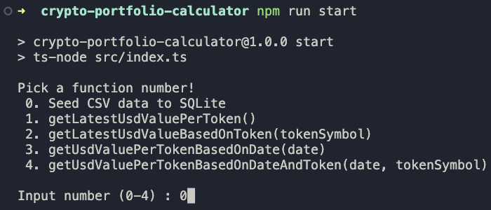

# Crypto Portfolio Calculator

# Rationale

*“We're looking at your programming ability. It must not only work, it should be maintainable.”*

To achieve maintainability I decided to involve SQL database in this project because the data has 30 million rows. I chose SQLite because it’s very simple to set up.

Basically we just need to prepare the .csv file and then seed/import it to the SQLite database. After the data is in the SQLite database, we can perform our desired query to get information from it, this will reduce time and increase performance compared to if we create a stream to the .csv file every time we want to perform a function. After we get the data then we can call cryptocompare api to get the token price on the date we want. After we get the price then we can get the USD value by multiplying the net amount and the price.

# Limitations

1. We cannot get the exact price of the token on the time when the user makes transactions because the api only provides a minutely historical price for the last 7 days. So I use hourly historical prices instead.

2. Seeding the .csv data into SQLite database. For the first time we are running this project, we need to seed the .csv file into the SQLite database and it takes some time. It took me 4 hours to seed the .csv file into the SQLite database using my laptop. But we only do it once. After it’s done, we do not need to do it again.

3. If there is new data in the .csv file, the data must be below the existing data. If the data order is put in randomly then there are possibilities for data duplications.

4. If there is new data in the .csv file we need to seed again to insert new data to SQLite database. But it won’t take too long like the first seeding, because the function will only insert if the data does not exist in the SQLite database.

# Prerequisites

## Tools

1. NPM

2. NodeJS

## Data

1. CSV file : [transactions.csv](https://s3-ap-southeast-1.amazonaws.com/static.propine.com/transactions.csv.zip)

2. SQLite database (optional. You can generate this database when everything is set up) : [crypto-portfolio-db.sqlite](https://drive.google.com/file/d/12M4K2tVOEXat01DYOSVMOlUhNn1-dFkV/view?usp=share_link)

3. All of the files are compressed into .zip. Don't forget to extract it first.

# Project Setup

1. Clone this repo.

2. Copy the transaction.csv file into ‘src/data’.

3. (Optional) Copy the SQLite database into ‘src/data’.

4. Installing the dependencies.

-- `npm i`

5. Duplicate the .env.example and rename it to .env. Fill CRYPTOCOMPARE_API_KEY with your api key.

# Running the project
  
1. Start the project by typing this command.

-- `npm run start`

3. (If you do not copy the SQLite database) choose 0 to seed transaction data from .csv file into SQLite database.

# Use Case Testing

1. “Given no parameters, return the latest portfolio value per token in USD”.

- To perform this function we need to start the project first.

--`npm run start`

- Choose 1 in the terminal.

2. “Given a token, return the latest portfolio value for that token in USD”.

- To perform this function we need to start the project first.

-- `npm run start`

- Choose 2 in the terminal.

- Type the token name. Option : ‘BTC’ , ‘ETH’ , ‘XRP’.

3. “Given a date, return the portfolio value per token in USD on that date”.

- To perform this function we need to start the project first.

-- `npm run start`

- Choose 3 in the terminal.

- Type the date you want to know the user’s portfolio in epoch unix format.

4. “Given a date and a token, return the portfolio value of that token in USD on that date”.

- To perform this function we need to start the project first.

-- `npm run start`

- Choose 3 in the terminal.

- Type the date you want to know the user’s portfolio in epoch unix format.

- Type the token name. Option : ‘BTC’ , ‘ETH’ , ‘XRP’.

## Authors

- [@fgprayogo](https://www.github.com/fgprayogo)
---# crypto-portfolio-calculator